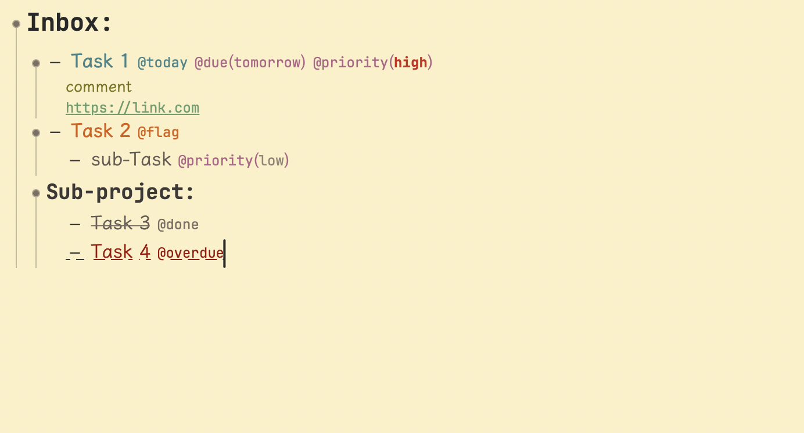

# My App Themes

This repository shares my theme settings for various apps.

## [TaskPaper](./TaskPaper/)

This Gruvbox theme is based on [morhetz/gruvbox](https://github.com/morhetz/gruvbox?tab=readme-ov-file). I modified the colors for the light version and added specific color settings for tags like `@today` and `@due`. For Chinese text, I use the [lxgw/LxgwWenKai](https://github.com/lxgw/LxgwWenKai) font, while JetBrains Mono from [ryanoasis/nerd-fonts](https://github.com/ryanoasis/nerd-fonts) serves as my monospaced font.

